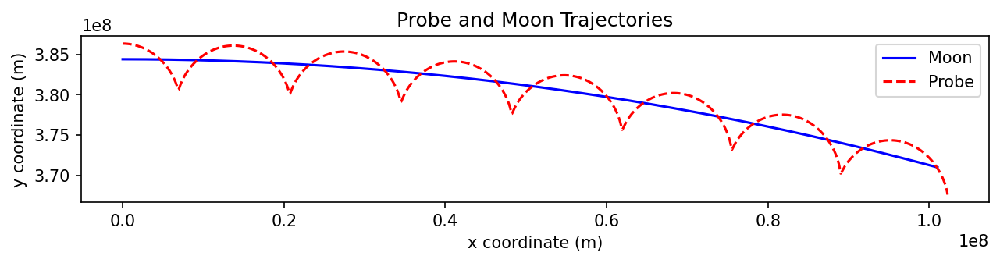

# Earth-Moon-Probe Orbital Dynamics Simulation

> Numerical integration of the two-body Earth-Moon system and the three-body Earth-Moon-Probe system using adaptive Runge-Kutta.

## Overview

Two interactive orbital-mechanics problems solved with SciPy's `solve_ivp`: a one-month Moon orbit around Earth, and a spacecraft in low lunar orbit (200 km altitude) under the simultaneous gravitational influence of both Earth and Moon.

## Key Features

- **Two distinct problems** in one script — single-body and coupled three-body
- **Adaptive Runge-Kutta integration** (`scipy.integrate.solve_ivp`, RK45 by default) with tight tolerances (`rtol=1e-8`, `atol=1e-11`)
- **State vectors and derivatives** written cleanly so the integrator handles all step-size logic
- **Equal-aspect plotting** so orbits aren't visually distorted by axis scaling

## Tech Stack

`Python` · `NumPy` · `SciPy` (`integrate.solve_ivp`) · `Matplotlib`

## Approach

The Moon-only problem (option 1) integrates Newton's law of gravitation for a single body around a fixed Earth. The state vector is `[x, y, vx, vy]` and the derivative function returns velocities and gravitational accelerations.

The three-body problem (option 2) extends the state vector to eight components — four for the Moon and four for the probe — and the derivative function now includes a second gravitational term for the probe, since it feels both Earth's and the Moon's gravity, while the Moon itself only feels Earth's. The Moon-probe distance is recomputed at every integration step.

Tolerances are set tight enough (1e-8 relative, 1e-11 absolute) to keep orbital energy approximately conserved over the integration window without making the integration prohibitively slow. Looser tolerances visibly degrade the orbit shape over a single month for the two-body case, and much faster for the three-body case.

## Results

The simulation produces:
- **Option 1**: closed elliptical orbit of the Moon around Earth over ~1 lunar month
- **Option 2**: combined trajectory plot showing the Moon's path alongside the probe's coupled orbit — the probe orbits the Moon, while the Moon orbits Earth, producing a characteristic spirograph-like trace in the Earth-centred frame



## How to Run

```bash
git clone https://github.com/<your-username>/earth-moon-probe-simulation.git
cd earth-moon-probe-simulation
pip install -r requirements.txt
python earth_moon_probe_simulation.py
```

You'll be prompted to choose between option `1` (Moon orbit) and option `2` (Earth-Moon-Probe). Enter `q` to quit.

No external data required. All physical constants and initial conditions are defined at the top of the script.
